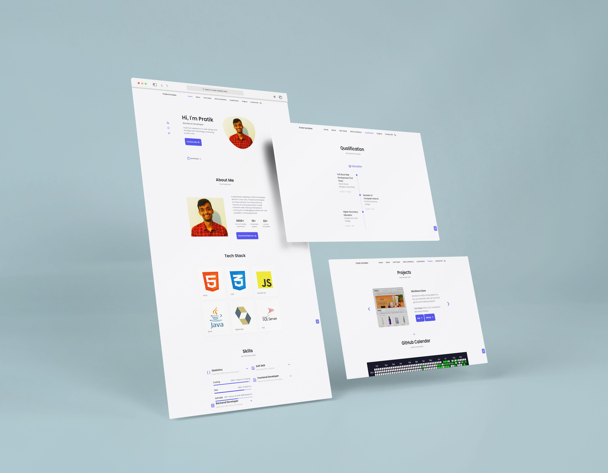
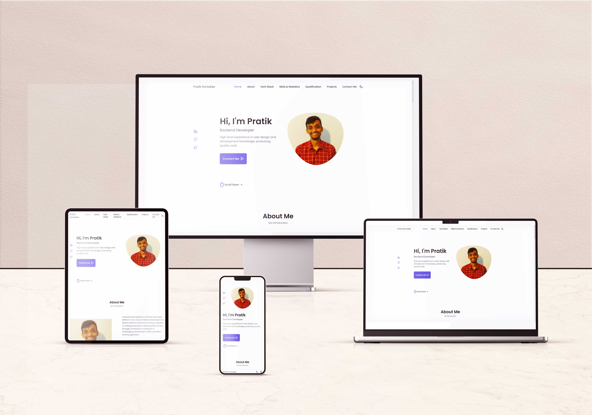

<h1 align="center"> Hello,  I'm Pratik Sontakke</h1>

# 💫 About Me : 
- 🔭 I’m currently building [RentoMojo](https://jovial-dusk-c6ab4b.netlify.app/).
- 🌱 I’m currently learning more about Java.
- 👯 I’m looking to collaborate on Backend Projects.
- 👨‍💻 All of my projects are available at **[My Portfolio](https://pratiksontakke.github.io/)**
- ⚡ Fun fact: I spend almost 6 hours listening to songs every day.
- 📫 How to reach me <b>( pratikass488@gmail.com )</b>

## 🌐 Connect with me :
    

<!--   -->

## 💻 Tech Stack
                    

## 📈 Activity Graph

	

## 💳 Github Profile Summary Card

  

## 📟 GitHub Stats

	
	

### ✍️Random Dev Quote

#### Website Presentation :
**[My Portfolio](https://pratiksontakke.github.io/)**
 
 

<h2 align='center'>Support Me By Starring ⭐ Some Of My Repositories</h2>
 

</img>

 
